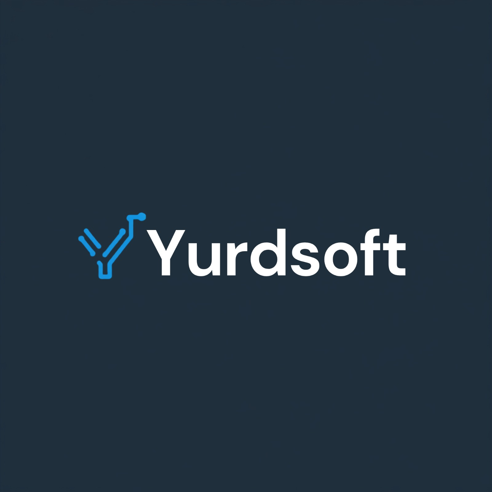
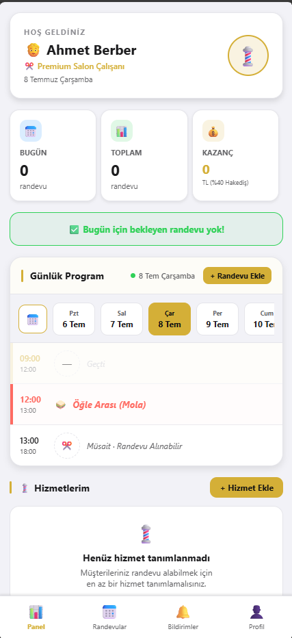
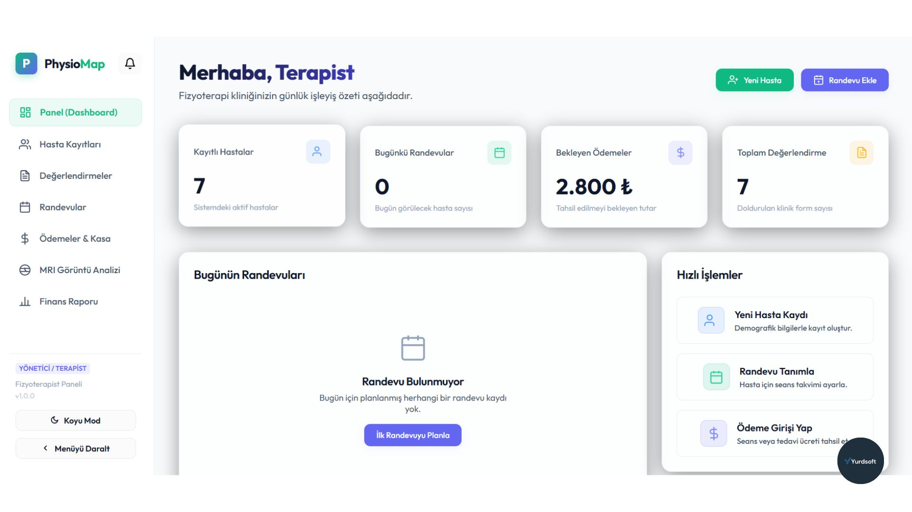

# Ahmet Yurdal (Yurdalsoftware) - Personal Portfolio Website

<div align="center">
  
  <h3>Ahmet Yurdal | Yurdalsoftware</h3>
  <p><strong>.NET & C# Developer | Next.js & React Expert | Full-Stack Developer</strong></p>

  <p>
    <a href="https://github.com/AhmetM125" target="_blank">
      
    </a>
    
    
    
    
  </p>
</div>

---

## 🇹🇷 Proje Hakkında

Bu proje, **Yurdalsoftware** bünyesinde **Ahmet Yurdal** için geliştirilmiş modern, şık ve performansı optimize edilmiş bir kişisel portfolyo web sitesidir. Next.js App Router (Turbopack) ve Vanilla CSS (CSS Modules) teknolojileri kullanılarak inşa edilmiştir.

### 🌟 Öne Çıkan Özellikler

* **Çift Dil Desteği (i18n)**: Türkçe ve İngilizce dilleri arasında dinamik geçiş sağlayan, dairesel bayrak ikonlu ve hover tetiklemeli lüks dil açılır menüsü (Dropdown).
* **Tema Değiştirici (Light / Dark Mode)**: Gece ve gündüz modları arasında anlık geçiş imkanı. Seçilen tercih tarayıcı belleğinde saklanır.
* **Markaya Uyumlu Özel Renk Paleti**: Ahmet Yurdal'ın kendi logosundan ilham alan, derin siyah ve elektrik neon mavisi (`#00a0ff`, `#5040e0`) tonlarında şekillenen yüksek kaliteli arayüz tasarımı.
* **Seçkin Projeler Modülü**:
  * **Berber Randevu Uygulaması** ve **Fizik Tedavi Yönetim Uygulaması** için özel olarak tasarlanmış mockup görselleri.
  * Modallarda **çoklu fotoğraf desteği**, görsellerin kırpılmasını önleyen `contain` yapısı ve her görsele özel dinamik açıklamalar (Captions).
  * Görselleri tam ekranda kayıpsız incelemek için **Fullscreen Lightbox** modu.
* **SEO & Hız Optimizasyonu**: Dinamik Sitemap (`/sitemap.xml`) ve robot yönergeleri (`/robots.txt`), doğru `lang` öznitelikleri ve Core Web Vitals kriterlerine tam uyumluluk.

---

## 🇬🇧 About The Project

This is a modern, premium, and performance-optimized personal portfolio website built for **Ahmet Yurdal** under the brand **Yurdalsoftware**. It is developed using Next.js App Router (Turbopack) and Vanilla CSS (CSS Modules).

### 🌟 Key Features

* **Multi-Language Support (i18n)**: A premium hover-triggered language dropdown selector containing circular country flag icons (Turkey & United Kingdom) to switch instantly between TR and EN.
* **Theme Switcher (Light / Dark Mode)**: Seamless toggle between day and night modes. The user's preference is remembered across sessions.
* **Brand-Matching Custom Theme**: Interface styles tailored to match the custom logo, using deep black backgrounds paired with glowing neon sky-blue (`#00a0ff`) and electric indigo (`#5040e0`) details.
* **Interactive Projects Grid**:
  * Visual mockup showcases for **Barber Appointment App** and **Physical Therapy Management App**.
  * Detailed modals supporting **multiple image previews**, crop-free `contain` scaling, and dynamic image captions.
  * A **Fullscreen Lightbox overlay** to view high-resolution screenshots without cropping.
* **SEO & Performance**: Dynamic XML Sitemap generation (`/sitemap.xml`), Robots directives (`/robots.txt`), correct language metadata, and self-hosted fonts ensuring high Google PageSpeed scores.

---

## 📸 Proje Ekran Görüntüleri / Screenshots

### 💈 Berber Randevu Uygulaması (Barber Booking App)
<div align="center">
  
  <p><em>Barber Booking System - Dynamic Appointment & Shift Scheduler</em></p>
</div>

### 🩺 Fizik Tedavi Yönetim Uygulaması (Physical Therapy App)
<div align="center">
  
  <p><em>Physical Therapy Management UI - Dynamic Muscle Mapping & Treatment Analytics</em></p>
</div>

---

## 🛠️ Kullanılan Teknolojiler / Built With

* **Core Framework**: [Next.js](https://nextjs.org/) (App Router, Turbopack)
* **Library**: [React.js](https://react.dev/)
* **Styling**: Vanilla CSS (CSS Modules)
* **Fonts**: Google Fonts (Outfit & JetBrains Mono)
* **SEO**: Built-in Next.js Metadata API
* **Icons**: Inline SVG Icons (Custom-designed vector flags and utility controls)

---

## 🚀 Kurulum ve Çalıştırma / Installation & Getting Started

Projeyi yerel bilgisayarınızda çalıştırmak için aşağıdaki adımları takip edebilirsiniz:

1. **Depoyu Klonlayın veya İndirin / Clone the repository:**
   ```bash
   git clone https://github.com/AhmetM125/Portfolio.git
   cd Portfolio
   ```

2. **Bağımlılıkları Yükleyin / Install dependencies:**
   ```bash
   npm install
   ```

3. **Geliştirme Sunucusunu Başlatın / Start the development server:**
   ```bash
   npm run dev
   ```
   *Next.js yerel sunucusuna [http://localhost:3000](http://localhost:3000) adresinden erişebilirsiniz.*

4. **Üretim Sürümünü Derleyin / Build for production:**
   ```bash
   npm run build
   npm start
   ```

---

## 📬 İletişim / Contact

* **Ad-Soyad**: Ahmet Yurdal
* **Şirket**: Yurdalsoftware
* **E-Posta**: yurdsoft@gmail.com
* **GitHub**: [@AhmetM125](https://github.com/AhmetM125)
